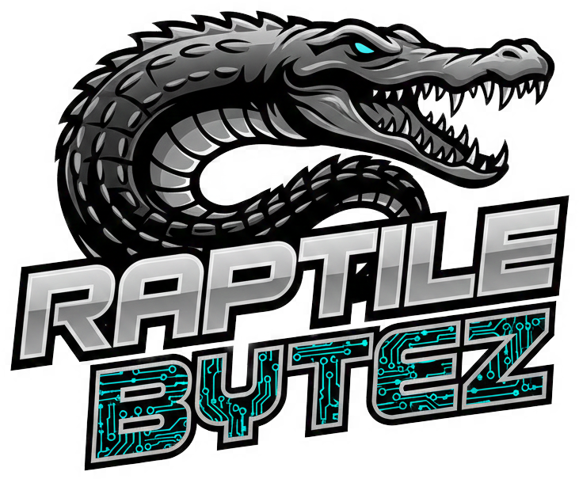

# 🍷 Giulia: Professional Executive AI Assistant
### Enterprise-Grade Architecture | Model-Agnostic Design | Advanced Steerability

<div align="center">
    
    <br>
    
</div>

---

## ⚡ Quick Summary (Recruiter View)
* **What it is:** A robust AI framework demonstrating high-precision persona control and model-agnostic architecture.
* **Core Skills:** Advanced Python, LLM-Ops, System Integration, and Adapter-Pattern Architecture.
* **Seniority:** Built by a PLM Expert with 15+ years of Enterprise experience, bridging the gap between legacy systems and AI.

---

## 📋 Executive Summary
**Giulia** is a technical reference implementation for transitioning **Enterprise PLM expertise** into **AI Engineering**. This project solves the "Vendor Lock-in" problem by using a decoupled architecture, allowing businesses to switch between AI providers (Gemini, OpenAI, Llama) without rewriting their core logic.

> **Business Relevance:** Companies need AI that follows strict corporate guidelines. Giulia proves that LLMs can be steered with 100% adherence to bilingual protocols and length constraints.

---

## 🛠️ Skills Demonstrated
* **System Architecture:** Provider & Adapter Patterns for model-agnosticism.
* **Data Persistence:** Normalized, vendor-neutral JSON state management.
* **AI Steerability:** Precise control of tone, language, and logic through structured prompting.
* **Modern Tooling:** High-performance dependency management via `uv`.

---

## 🧠 Engineering Highlights
* **Decoupled AI Core**: Implementation of an `AIModelInterface`. Switch LLM providers via CLI without touching the orchestrator logic.
* **Universal History Manager**: Automatically normalizes vendor-specific data (e.g., Gemini Content Objects) into a standard schema for long-term auditability.
* **Hierarchical Prompting**: Managed asset structure (`core`, `tasks`, `library`) to optimize LLM performance while keeping code clean.

---

## 🎭 Persona Philosophy: Professional Context-Awareness
Instead of a generic chatbot, Giulia acts as a **High-Context Executive Assistant**:
* **Steerability Proof:** Demonstrates how to maintain a sophisticated, charismatic, yet strictly professional tone over long conversations.
* **Operational Constraints:** Hard-enforced 60-word limits and bilingual automatic detection.
* **Enterprise Identity:** She is programmed to recognize and augment the user's specific background in PLM and System Architecture.

---

## 🚀 Getting Started

### Installation
1.  **Install uv**: `curl -LsSf https://astral.sh/uv/install.sh | sh`
2.  **Setup Environment**:
    ```bash
    git clone [https://github.com/RaptileBytez/giulia-ai.git](https://github.com/RaptileBytez/giulia-ai.git)
    cd giulia-ai
    uv sync
    echo "GEMINI_API_KEY=your_key_here" > .env
    ```

### Running Giulia
```bash
uv run main.py              # Launch Standard Session
uv run main.py --mock       # Developer Test Mode (Zero Cost)
```

## 📂 Project Structure
```text
├── data/
│   ├── chat_history/           # Session JSON files (Git-ignored)
│   └── logs/                   # Application and API logs (Git-ignored)
├── prompts/                    # New Hierarchical Structure
│   ├── core/                   # Identity (Giulia persona, wrappers)
│   ├── tasks/                  # Active production prompts (categorized)
│   └── library/                # Research & model-optimized assets (OpenAI, etc.)
├── utils/
│   ├── ai/                     # AI Core Subpackage
│   │   ├── __init__.py         # Central exports
│   │   ├── model_interface.py  # Abstract base classes
│   │   ├── model_provider.py   # Gemini & Mock implementations
│   │   ├── prompt_loader.py    # Path-based templating engine
│   │   └── history_manager.py  # Persistence logic
│   └── logger.py               # Unified logging system
├── chatbot.py                  # Refactored Orchestrator using Interface
└── main.py                     # Entry point with argparse support
```

---

## 👤 About the Author: Jesco Wurm

Behind the creative label Raptile Bytez is a seasoned Enterprise Systems Expert and PLM Consultant with 15+ years of experience in the Oracle Agile e6 ecosystem.

With a degree in Business Information Systems (2009), I focus on bringing "Industrial-Grade" stability to the world of AI Engineering. I build systems that don't just "talk," but integrate into complex professional workflows.

### 🛠️ Tech Expertise & Interests
* **Enterprise:** Oracle Agile e6, PLM Architecture, System Integration.
* **AI & Automation:** LLM Orchestration (Gemini, OpenAI), Prompt Engineering, Python.
* **Philosophy:** Clean Code, Modular Design, and Stateless Architecture.

### 🤝 Let's Connect
I am currently building my network in the AI space. Whether you are an AI enthusiast, a fellow developer, or a recruiter looking for a consultant with both business logic and AI-coding skills — let's connect!

[](https://www.linkedin.com/in/jesco-wurm)
[](https://github.com/RaptileBytez)

---

## ⚖️ License
MIT License - See LICENSE for details.